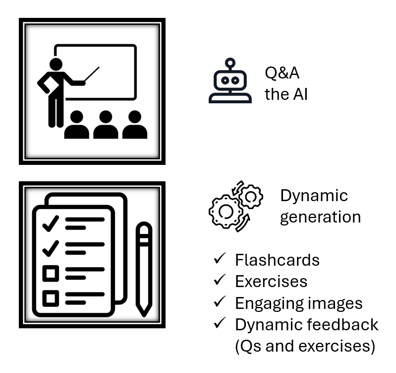
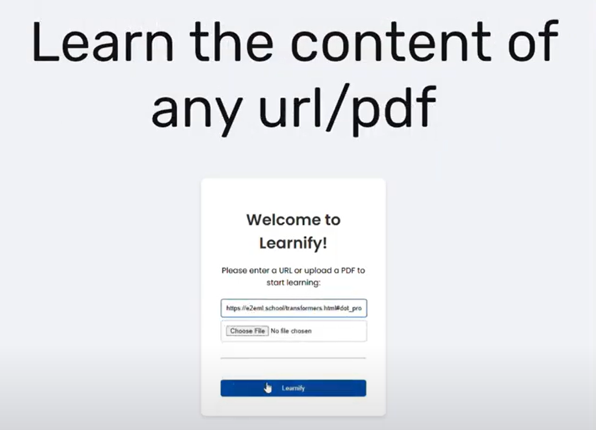

# Learnify

# Learnify

## Simplify Learning with AI

Learnify is an AI-powered tool designed to simplify the learning process by transforming the content of any URL or PDF into interactive and engaging learning materials. With Learnify, users can interact with learning content, ask questions, and receive dynamically generated flashcards and exercises tailored to their level of understanding.

  

## Features

- **Interactive Q&A**: Engage with the content by asking questions directly to the AI.
- **Dynamic Flashcards**: Automatically generated flashcards summarize key information for quick review.
- **Tailored Exercises**: Dynamic exercises adjust to your understanding, reinforcing areas that need improvement.
- **Engaging Images**: AI-generated images help visualize concepts and keep you engaged.

## How It Works

### Client-Side

The client-side is built with HTML, CSS, and JavaScript, providing a seamless user interface for interacting with learning materials.

### Server-Side

The server-side, written in Python using Flask, consists of three main files:

- **app.py**: Manages the core functionality including content processing, flashcard generation, and interactive Q&A.
- **constants.py**: Contains predefined templates for exercises and flashcards.
- **utils.py**: Provides utility functions for handling AI models and content processing.

## Screenshots

   
   
   

## Demo
Check out [our demo video](https://youtu.be/h4TQWaT4Duo) to see Learnify in action!
